## Path (final submission)

Please fill this out and submit your work to Gradescope by the deadline.

### Output Comparison

Run the program with the specified `.ini` config file to compare your output against the reference images. The program should automatically save to the correct path for the images to appear in the table below.

If you are not using the Qt framework, you may also produce your outputs otherwise so long as you place them in the correct directories as specified in the table. In this case, please also describe how your code can be run to reproduce your outputs

> Qt Creator users: If your program can't find certain files or you aren't seeing your output images appear, make sure to: 
>
> 1. Set your working directory to the project directory
> 2. Set the command-line argument in Qt Creator to `template_inis/final/<ini_file_name>.ini`

Note that your outputs do **not** need to exactly match the reference outputs. There are several factors that may result in minor differences, such as your choice of tone mapping and randomness.

Please do not attempt to duplicate the given reference images; we have tools to detect this.

|         `.ini` File To Produce Output         |                 Expected Output (No Gamma)                  |                                   Expected Output                                    |                                                                         Your Output                                                                         |
| :-------------------------------------------: | :----------------------------------------------------------: | :----------------------------------------------------------------------------------: | :---------------------------------------------------------------------------------------------------------------------------------------------------------: |
|         cornell_box_full_lighting.ini         |          |          | 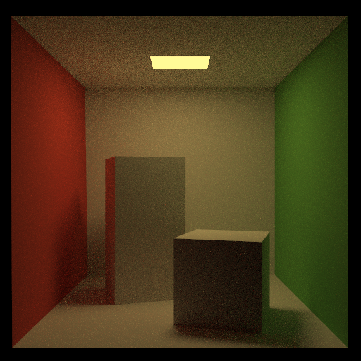                 |
|     cornell_box_direct_lighting_only.ini      |   |   | 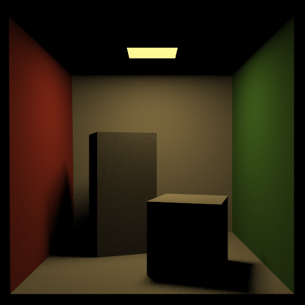          |
| cornell_box_full_lighting_low_probability.ini |  |  | 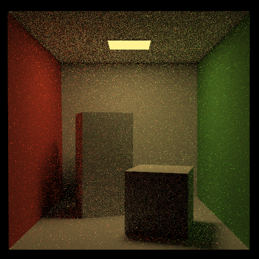 |
|                  mirror.ini                   |                                     |                                     |                                    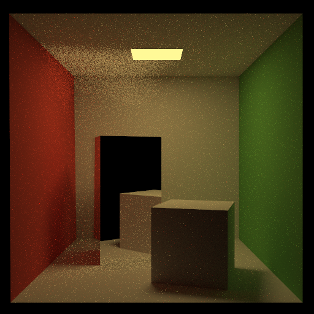                                    |
|                  glossy.ini                   |                                     |                                     |                                    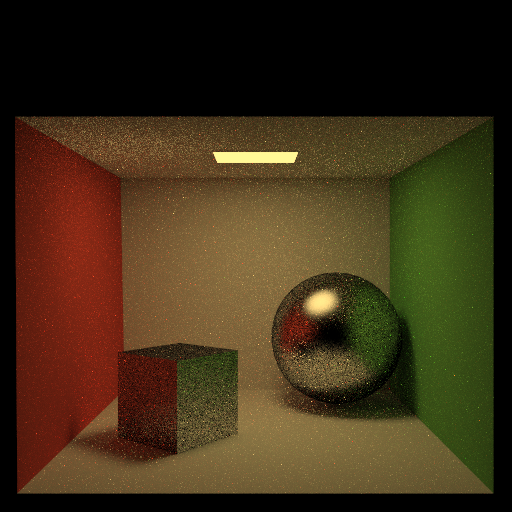                                    |
|                refraction.ini                 |                                 |                                 |                                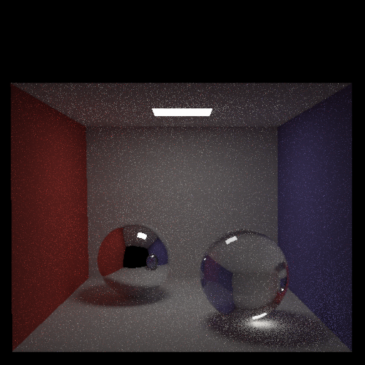                                |

> Note: The reference images above were produced using the [Extended Reinhard](https://64.github.io/tonemapping/#extended-reinhard) tone mapping function with minor gamma correction. You may choose to use another mapping function or omit gamma correction.

### Implementation Locations

Please link to the lines (in GitHub) where the implementation of these features start:

- [Diffuse Reflection]() -> pathtracer.c++ lines 469 to 504
- [Glossy Reflection]() -> pathtracer.c++ lines 469 to 504
- [Mirror Reflection]() -> pathtracer.c++ lines 405 to 410
- [Refraction (with Fresnel refletion)]() -> pathtracer.c++ lines 411 to 466
- [Soft Shadows]() -> pathtracer.c++ lines 281 to 360
- [Illumination]() -> pathtracer.c++ lines 281 to 360 or 544 to 591
- [Russian Roulette path termination]() -> pathtracer.c++ line 404
- [Event Splitting]() -> pathtracer.c++ lines 281 to 360 and 397 to 400
- [Tone Mapping]() -> pathtracer.c++ 544 to 591
- [Stratified Sampling]() -> pathtracer.c++ 228 to 240
- [Fixed function denoising]() -> pathtracer.c++ 70 to 185
- [Learned denoising]() -> model.py and test_data, train_data folders
- [Low discrepancy sampling]() -> pathtracer.c++ 37 to 50
- [Attenuate refracted paths]() -> pathtracer.c++ 445 to 462
- Any extra features

### Design Choices

Please list all the features your path tracer implements.

Diffuse, Glossy, Mirror reflection, Refraction (with Fresnel reflection), Soft shadows, illumination, tone mapping, event splitting, stratified sampling, fixed function denoising, learned denoising, low discrepancy sampling, attentuate refracted paths. 

### Extra Features

Briefly explain your implementation of any extra features, provide output images, and describe what each image demonstrates.

Here is the fixed function denoising. I using 50 samples per pixel for both outputs, the first one is without fixed function and the second picture is with fixed function denoising. As you see there is a big difference and it is more smooth:

 | 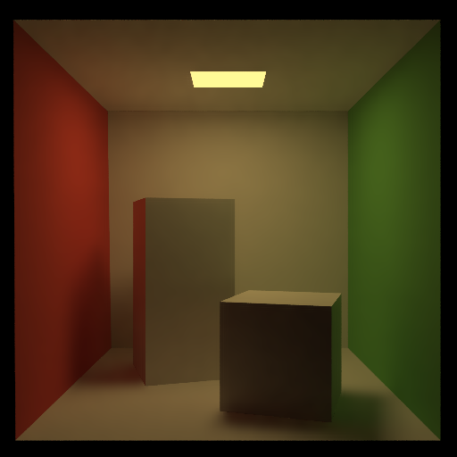

Here is my stratified sampling (left is stratified right is normal):

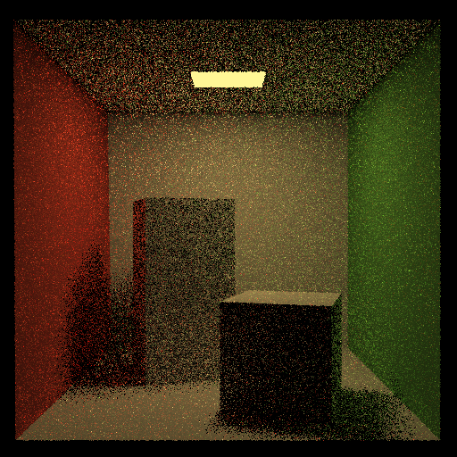 | 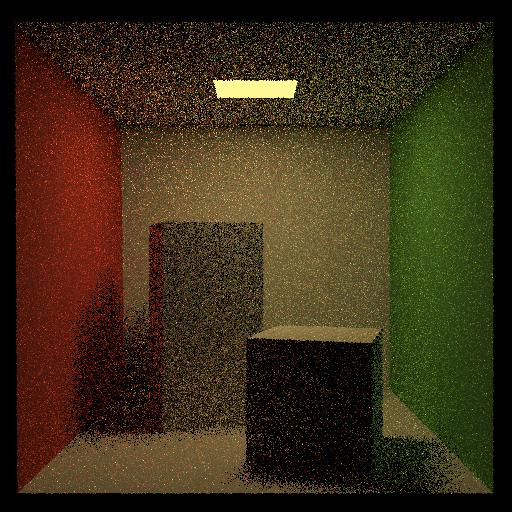

Here is my Learned Denoising:

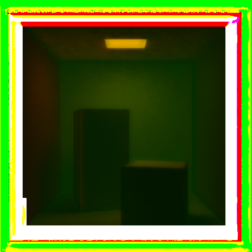 | 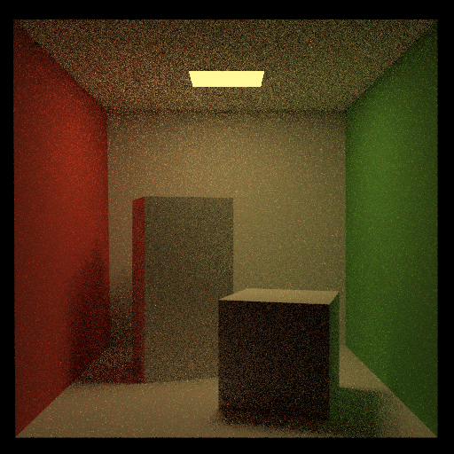

Here is my low discrepancy sampling:

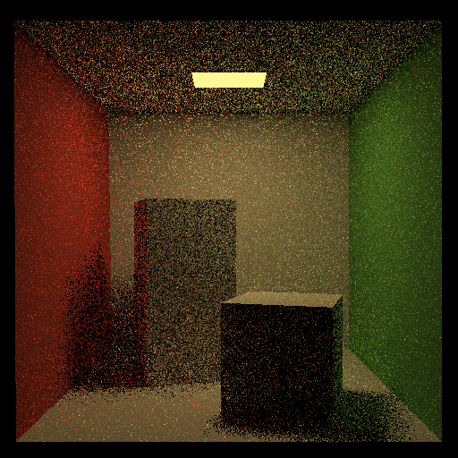 | 

Here is my refracted paths:

 | 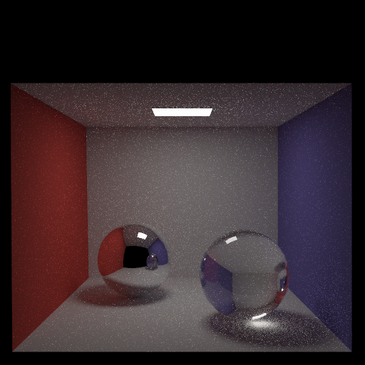

### Collaboration/References

### Known Bugs

My light is slightly brighter than the reference light and I am not sure why that is the case. Also for my learned denoising I really tried hard to get it to work by generating my own testing sets from the testing files we had. Then I made my own architecture and tested many parameters and some changes but none of them fully worked with my training data. 
